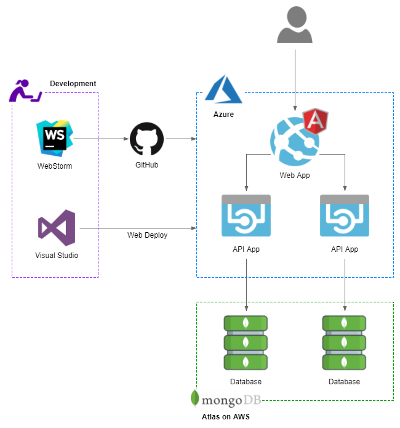

# RESTful Services Restaurant API Demo

Set of RESTful services built with C# using Microsoft’s Web API 2 and .NET 4.7. Developed for the following post, [Developing Applications for the Cloud with Azure App Services and MongoDB Atlas](https://wp.me/p1RD28-5ij). Services are designed to be deployed as Azure API Apps, backed by MongoDB Atlas.

